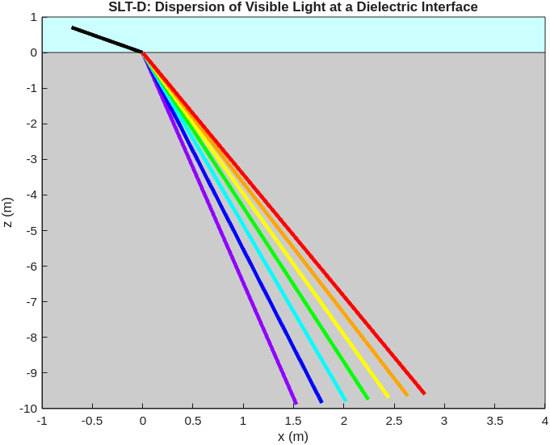
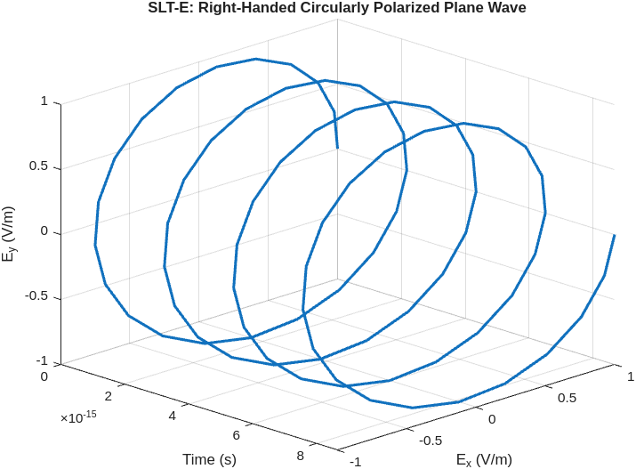
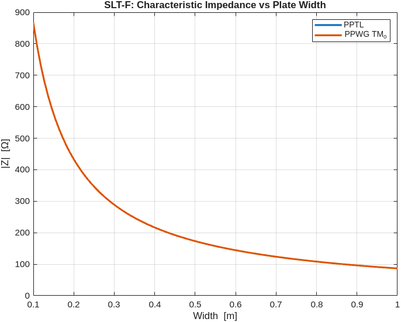

# Electromagnetics 2 (5EPB0), TU/e

MATLAB code for the self-learning tasks (SLT) of the Electromagnetics 2 course (5EPB0) at Eindhoven University of Technology. The scripts cover refraction and dispersion, plane-wave polarization, reflection and transmission at a planar interface, parallel-plate waveguide impedance, and rectangular cavity resonator modes with a free-space link budget. The figures below are produced by running the scripts in this repository.

## SLT-D: Snell's law and dispersion

`SLTD_studenttemplate.m` works through refraction at a dielectric interface. It plots the refracted angle against the incident angle for two refractive-index pairs, draws a contour plot of the index contrast n2/n1 over incident and refracted angle, and models chromatic dispersion by giving the second medium a wavelength-dependent refractive index (a Cauchy relation n = a + b/lambda^2). Splitting white light into seven wavelengths shows each color refracting at a slightly different angle.



## SLT-E: plane-wave polarization

`SLTE_studenttemplate.m` visualizes plane waves travelling in the +z direction as 3D curves of the electric field over time. It builds an attenuating travelling wave, a right-handed circularly polarized wave, a left-handed elliptically polarized wave, and a wave with a 60 degree phase difference between the x and y components, and can export the attenuating case as an animated GIF.



## SLT-F: reflection, transmission, and waveguide impedance

`SLTF_studenttemplate.m` animates a pulse hitting a planar discontinuity between two media, computing the reflection coefficient R = (n1 - n2)/(n1 + n2) and transmission coefficient T = 2n1/(n1 + n2) and drawing the incident, reflected, transmitted, and total waves for block, triangular, sine, and step waveforms.

`SLTF_Ex5_studenttemplate.m` compares the characteristic impedance of the TM_0 mode in a parallel-plate waveguide against a finite-width parallel-plate transmission line built with the RF Toolbox, sweeping plate width, frequency, and line length to find where the two agree.



The transmission-line and waveguide curves fall on top of each other across the width sweep, which is the point of the exercise: the TM_0 wave impedance matches the parallel-plate transmission-line impedance.

## SLT-G: cavity resonator and link budget

`SLTG_q4.m` computes the resonant frequencies of a rectangular cavity resonator for mode indices (n, m, p) over a range, then sorts them to list the lowest hundred modes. `sltg_last.m` holds a free-space link-budget calculation: free-space path loss with `fspl`, thermal noise power from bandwidth and temperature, and the transmit power needed to meet a target SNR at the receiver, set up for an Earth-to-Mars distance.

## Repository layout

```
SLTD_studenttemplate.m       Snell's law, index contrast, chromatic dispersion
SLTE_studenttemplate.m       plane-wave polarization (linear, circular, elliptical), GIF export
SLTF_studenttemplate.m       reflection and transmission animation at a planar interface
SLTF_Ex5_studenttemplate.m   parallel-plate waveguide vs transmission-line impedance
SLTG_q4.m                    rectangular cavity resonator modes
sltg_last.m                  free-space path loss and link budget
docs/readme/                 figures produced by the scripts, used in this README
```

## Running

The scripts run in MATLAB. Each file corresponds to one self-learning task and can be run on its own; `SLTD` is organized in sections that are meant to be run cell by cell. `SLTF_Ex5_studenttemplate.m` needs the RF Toolbox (`rfckt.parallelplate`), and `sltg_last.m` uses `fspl` from the Communications Toolbox.

## Technologies

- MATLAB
- RF Toolbox
- Communications Toolbox (`fspl`)
